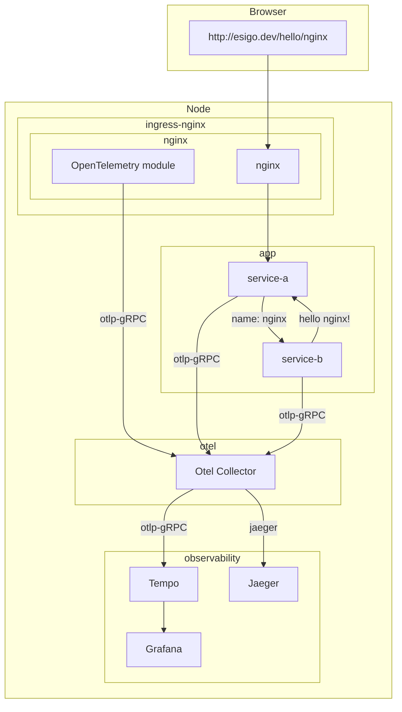

[](https://github.com/esigo/nginx-example/actions/workflows/ci.yaml)

# nginx-example

This repo hosts a simple app to demonstrate distributed tracing feature of nginx.


build images:
```console
make images
```

deploy demo app:
```console
make deploy-app
```

deploy otel collector, grafan, tempo and Jaeger all-in-one:
```console
make helm-repo
make observability
```

test:
```console
kubectl port-forward --namespace=ingress-nginx service/ingress-nginx-controller 8090:80
bash test.sh
```

##  controller-configmap.yaml:

```yaml
otlp-collector-host: "otel-coll-collector.otel.svc"
```

or

```yaml
otlp-collector-host: "tempo.observability.svc"
```
